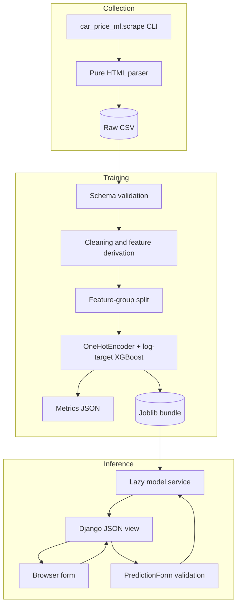

# Architecture

## Component boundaries



## Design decisions

### Raw data and model artifacts are ignored

The current CSV is roughly 11 MB and the model is generated output tied to specific dependency versions. Keeping them outside Git avoids repository growth and makes the documented scraper/training flow meaningful. A dataset SHA-256 and model SHA-256 are placed in the tracked metrics report for provenance.

### Cleaning is shared code

The former notebook transformations were moved to `car_price_ml.data`. Training and tests now call the same implementation, eliminating hidden notebook state and training/serving schema drift.

### Holdout groups identical model inputs

The source data contains repeated listings and many identical model-feature vectors. URLs are deduplicated first, then a stable hash of the seven model inputs is supplied to `GroupShuffleSplit`. Identical inputs therefore cannot appear in both partitions. A time split would be preferable once scrape timestamps exist.

### The target is log-transformed

Advertised prices are strongly right-skewed. `TransformedTargetRegressor` trains XGBoost against `log1p(price)` and applies `expm1` at inference. Metrics remain in original PKR units.

### The Django process loads lazily

Importing URL configuration no longer unpickles the model. The service loads and validates the bundle on first use, caches it under a lock, and reloads it when the artifact modification time changes. Missing or incompatible artifacts result in a controlled 503 instead of preventing application startup.

### Browser output is text-safe

The interface builds result nodes and assigns `textContent`; user input and server messages are never interpolated into `innerHTML`. Same-origin JSON requests send Django's CSRF token.

## Artifact contract

The joblib bundle contains:

```text
artifact_version
pipeline
metadata
├── trained_at_utc
├── feature_columns
├── known_categories
├── dataset_sha256
├── metrics
└── environment
```

Joblib/pickle files must only be loaded from trusted sources. They can execute Python code during deserialization.
